---
# Front matter
lang: ru-RU
title: "отчёта по лабораторной работе 12"
subtitle: "Операционные системы"
author: "Саинт Амур Измаэль"

# Formatting
toc-title: "Содержание"
toc: true # Table of contents
toc_depth: 2
lof: true # List of figures
lot: true # List of tables
fontsize: 12pt
linestretch: 1.5
papersize: a4paper
documentclass: scrreprt
polyglossia-lang: russian
polyglossia-otherlangs: english
mainfont: PT Serif
romanfont: PT Serif
sansfont: PT Sans
monofont: PT Mono
mainfontoptions: Ligatures=TeX
romanfontoptions: Ligatures=TeX
sansfontoptions: Ligatures=TeX,Scale=MatchLowercase
monofontoptions: Scale=MatchLowercase
indent: true
pdf-engine: lualatex
header-includes:
  - \linepenalty=10 # the penalty added to the badness of each line within a paragraph (no associated penalty node) Increasing the value makes tex try to have fewer lines in the paragraph.
  - \interlinepenalty=0 # value of the penalty (node) added after each line of a paragraph.
  - \hyphenpenalty=50 # the penalty for line breaking at an automatically inserted hyphen
  - \exhyphenpenalty=50 # the penalty for line breaking at an explicit hyphen
  - \binoppenalty=700 # the penalty for breaking a line at a binary operator
  - \relpenalty=500 # the penalty for breaking a line at a relation
  - \clubpenalty=150 # extra penalty for breaking after first line of a paragraph
  - \widowpenalty=150 # extra penalty for breaking before last line of a paragraph
  - \displaywidowpenalty=50 # extra penalty for breaking before last line before a display math
  - \brokenpenalty=100 # extra penalty for page breaking after a hyphenated line
  - \predisplaypenalty=10000 # penalty for breaking before a display
  - \postdisplaypenalty=0 # penalty for breaking after a display
  - \floatingpenalty = 20000 # penalty for splitting an insertion (can only be split footnote in standard LaTeX)
  - \raggedbottom # or \flushbottom
  - \usepackage{float} # keep figures where there are in the text
  - \floatplacement{figure}{H} # keep figures where there are in the text
---

## Цель работы: 
> Изучить основы программирования в оболочке ОС UNIX. Научится писать более сложные командные файлы с использованием логических управляющих конструкций и циклов.
## Ход работы:
1. Использую команды getopts grep, написала командный файл, который
анализирует командную строку с ключами:
- -iinputfile — прочитать данные из указанного файла;
- -ooutputfile — вывести данные в указанный файл;
- -pшаблон — указать шаблон для поиска;
- -C — различать большие и малые буквы;
- -n — выдавать номера строк,
а затем ищет в указанном файле нужные строки, определяемые ключом
–p.
Для данной задачи я создал файл, и открыл его в редакторе emacs, использую клавиши «Ctrl-x» и «Ctrl-f» (команды «touch pro.sh» и «emacs»)  и написал
соответствующие скрипты. (рис. -@fig:001) (рис. -@fig:002) (рис. -@fig:003)
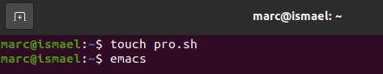{ # fig:001 width=70%} 
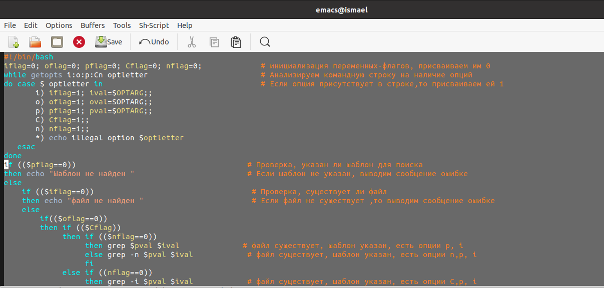{ # fig:002 width=70%}
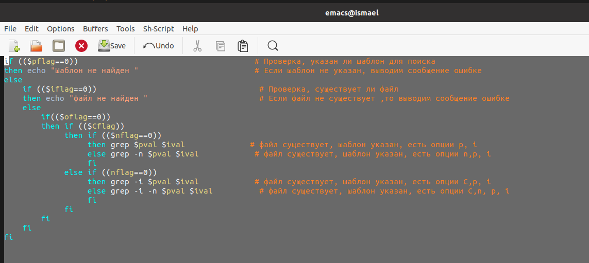{ # fig:003 width=70%}
- Далее я проверил работу написанного скрипта, используя различные
опции (например, команда «./pro.sh –I a1.txt –o a2.txt –p capital –C -n»),
предварительно добавив право на исполнение файла (команда «chmod +x
pro.sh») и создав 2 файла, которые необходимы для выполнения
программы: a1.txt и a2.txt.рис.Скрипт работает корректно -@fig:004)рис. -@fig:005)(рис. -@fig:006)
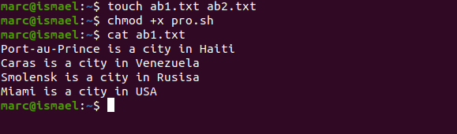{ # fig:004 width=70%} 
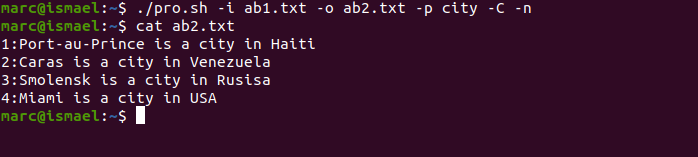{ # fig:005 width=70%} 
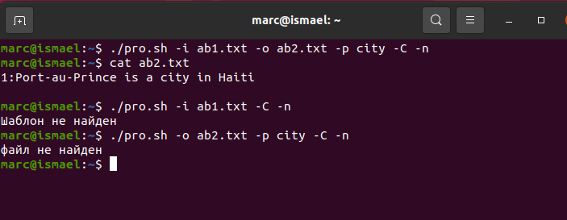{ # fig:006 width=70%}
2. Написал на языке Си программу, которая вводит число и определяет,является ли оно больше нуля, меньше нуля или равно нулю. Затем программа завершается с помощью функции exit(n), передавая информацию в о коде завершения в оболочку. Командный файл должен вызывать эту программу и, проанализировав с помощью команды $?, выдать сообщение о том, какое число было введено.
Для данной задачи я создала 2 файла: include.c  и include.sh и написал соответствующие скрипты.(рис. -@fig:007) c
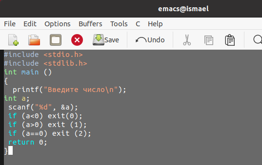{ # fig:007 width=70%}
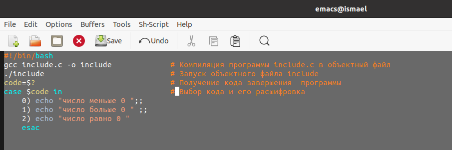{ # fig:008 width=70%}
- Далее я проверил работу написанных скриптов (команда «./include.sh»),предварительно добавив право на исполнение файла (команда «chmod +x
include.sh») Скрипты работают корректно.(рис. -@fig:009)
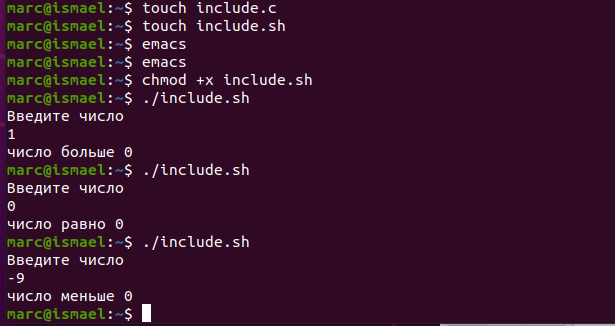{ # fig:009 width=70%}
3. Написал командный файл, создающий указанное число файлов,
пронумерованных последовательно от 1 до N (например 1.tmp, 2.tmp,
3.tmp,4.tmp и т.д.). Число файлов, которые необходимо создать, передаётся в аргументы командной строки. Этот же командный файл должен уметь,удалять все созданные им файлы (если они существуют.
Для данной задачи я создал файл: files.sh  и написал
соответствующий скрипт. (рис. -@fig:0010)
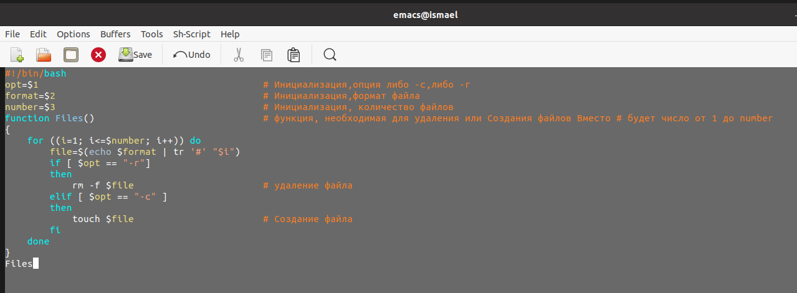{ # fig:0010 width=70%}
- Далее я проверил работу написанного скрипта (команда «./files.sh»), предварительно добавив право на исполнение файла (команда «chmod +x files.sh»). Сначала я создал три файла (команда «./files.sh –c abc#.txt 3»),удовлетворяющие условию задачи, а потом удалила их (команда «./files.sh
–r abc#.txt 3») (рис. -@fig:0011) (рис. -@fig:0012)(рис. -@fig:0013)
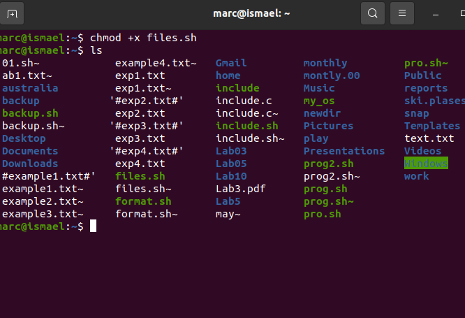{ # fig:0011 width=70%}
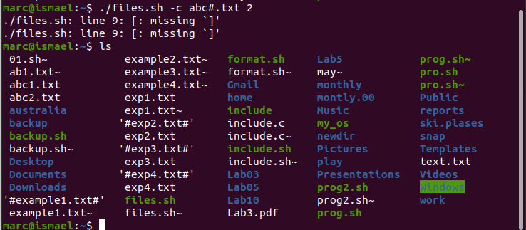{ # fig:0012 width=70%}
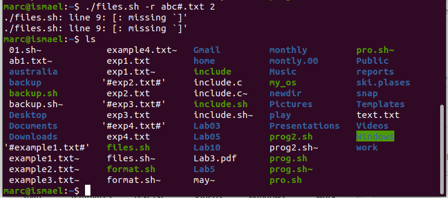{ # fig:0013 width=70%}
4. Написал командный файл, который с помощью команды tar
запаковывает в архив все файлы в указанной директории. Модифицировал его так, чтобы запаковывались только те файлы, которые были изменены менее недели тому назад (использовать команду find).Для данной задачи я создала файл: prog4.sh и написал соответствующий скрипт.(рис. -@fig:0014)
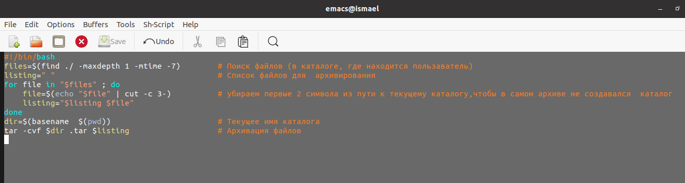{ # fig:0014 width=70%}
- Далее я проверил работу написанного скрипта (команды «sudo ~/prog4.sh» и «tar -tf Catalogue.tar»), предварительно добавив право на исполнение файла (команда «chmod +x prog4.sh») и создав отдельный Catalogue с несколькими файлами. файлы, измененные
более недели назад, заархивированы не были.
Скрипт работает корректно.(рис. -@fig:0015) (рис. -@fig:0016) (рис. -@fig:0017)
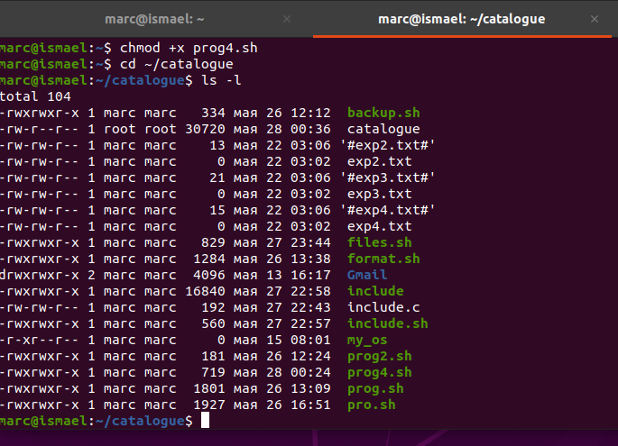{ # fig:0015 width=70%}
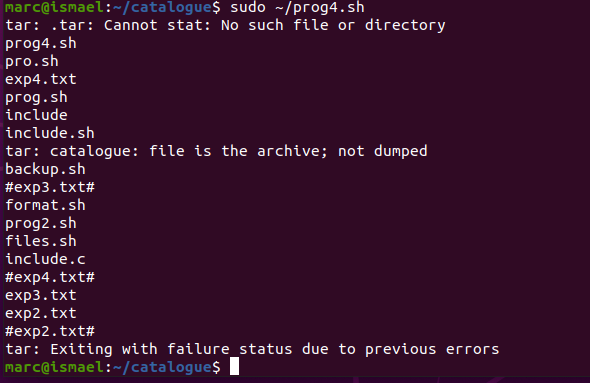{ # fig:0016 width=70%}
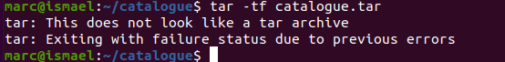{ # fig:0017 width=70%}
**Вывод:**
 В ходе выполнения данной лабораторной работы я изучила
основы программирования в оболочке ОС UNIX и научилась писать более
сложные командные файлы с использованием логических управляющих
конструкций и циклов.
**Контрольные вопросы:**
1. Команда getopts осуществляет синтаксический анализ командной строки,
выделяя флаги, и используется для объявления переменных. Синтаксис
команды следующий:
getopts option-string variable [arg ... ]
Флаги − это опции командной строки, обычно помеченные знаком минус;
Например, для команды ls флагом может являться -F.
Строка опций option-string − это список возможных букв и чисел
соответствующего флага. Если ожидается, что некоторый флаг будет
сопровождаться некоторым аргументом, то за символом, обозначающим
этот флаг, должно следовать двоеточие. Соответствующей переменной
присваивается буква данной опции. Если команда getopts может
распознать аргумент, то она возвращает истину. Принято включать getopts
в цикл while и анализировать введённые данные с помощью оператора
case.
Функция getopts включает две специальные переменные среды − OPTARG
и OPTIND. Если ожидается дополнительное значение, то OPTARG
устанавливается в значение этого аргумента.
Функция getopts также понимает переменные типа массив, следовательно,
можно использовать её в функции не только для синтаксического анализа
аргументов функций, но и для анализа введённых пользователем данных.
2. При перечислении имён файлов текущего каталога можно использовать
следующие символы:
- * − соответствует произвольной, в том числе и пустой строке;
- ? − соответствует любому одинарному символу;
- [c1-c2] − соответствует любому символу, лексикографически
находящемуся между символами с1 и с2.
Например,
- echo * − выведет имена всех файлов текущего каталога, что
представляет собой простейший аналог команды ls;
- ls *.c − выведет все файлы с последними двумя символами,
совпадающими с .c.
- echo prog.? − выведет все файлы, состоящие из пяти или шести
символов, первыми пятью символами которых являются prog..
- [a-z]* − соответствует произвольному имени файла в текущем
каталоге, начинающемуся с любой строчной буквы латинского
алфавита.
3. Часто бывает необходимо обеспечить проведение каких-либо действий
циклически и управление дальнейшими действиями в зависимости от
результатов проверки некоторого условия. Для решения подобных задач
язык программирования bash предоставляет возможность использовать
такие управляющие конструкции, как for, case, if и while. С точки зрения
командного процессора эти управляющие конструкции являются
обычными командами и могут использоваться как при создании
командных файлов, так и при работе в интерактивном режиме. Команды,
реализующие подобные конструкции, по сути, являются операторами
языка программирования bash. Поэтому при описании языка
программирования bash термин оператор будет использоваться наравне с
термином команда.
Команды ОС UNIX возвращают код завершения, значение которого может
быть использовано для принятия решения о дальнейших действиях.
Команда test, например, создана специально для использования в
командных файлах. Единственная функция этой команды заключается в
выработке кода завершения.
4. Два несложных способа позволяют вам прерывать циклы в оболочке bash.
Команда break завершает выполнение цикла, а команда continue завершает
данную итерацию блока операторов.
Команда break полезна для завершения цикла while в ситуациях, когда
условие перестаёт быть правильным.
Команда continue используется в ситуациях, когда больше нет
необходимости выполнять блок операторов, но вы можете захотеть
продолжить проверять данный блок на других условных выражениях.
5. Следующие две команды ОС UNIX используются только совместно с
управляющими конструкциями языка программирования bash: это
команда true, которая всегда возвращает код завершения, равный нулю
(т.е. истина), и команда false, которая всегда возвращает код завершения,
не равный нулю (т. е. ложь).
Примеры бесконечных циклов:
while true
 do echo hello andy
done
until false
 do echo hello mike
done
6. Строка if test -f man$s/$i.$s проверяет, существует ли файл man$s/$i.$s и
является ли этот файл обычным файлом. Если данный файл является
каталогом, то команда вернет нулевое значение (ложь).
7. Выполнение оператора цикла while сводится к тому, что сначала
выполняется последовательность команд (операторов), которую задаёт
список-команд в строке, содержащей служебное слово while, а затем, если
последняя выполненная команда из этой последовательности команд
возвращает нулевой код завершения (истина), выполняется
последовательность команд (операторов), которую задаёт список-команд в
строке, содержащей служебное слово do, после чего осуществляется
безусловный переход на начало оператора цикла while. Выход из цикла
будет осуществлён тогда, когда последняя выполненная команда из
последовательности команд (операторов), которую задаёт список-команд
в строке, содержащей служебное слово while, возвратит ненулевой код
завершения (ложь).
При замене в операторе цикла while служебного слова while на until
условие, при выполнении которого осуществляется выход из цикла,
меняется на противоположное. В остальном оператор цикла while и
оператор цикла until идентичны.